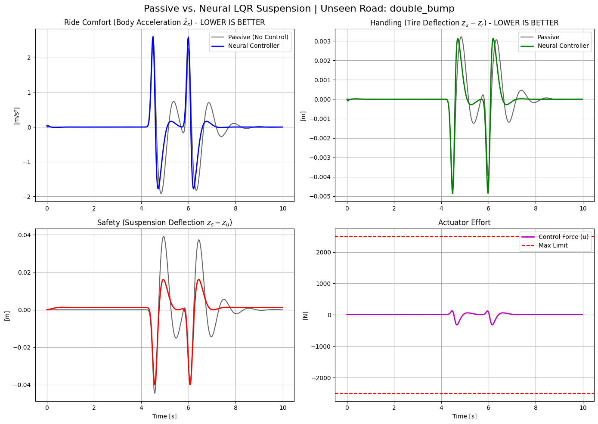

# NNCD
Data-driven neural network surrogate model simulating 2-DOF quarter-car suspension dynamics to predict transient vibration responses across varied road profiles.

# Neural Network Surrogate Modeling for Quarter-Car Suspension Dynamics

## 📌 Project Overview
This project applies deep learning to model and predict the dynamic behavior of a vehicle's suspension system. By training a neural network to mimic a mathematical **Quarter-Car Model**, the system effectively learns the complex non-linear dynamics of vehicle ride comfort and road handling. 

Once the network has successfully learned the baseline system, it is deployed to predict the vehicle's transient response across various deterministic road profiles (e.g., sine waves, bumps, and step inputs) over time.

## ⚙️ System Architecture & Vehicle Dynamics
The neural network acts as a data-driven surrogate for a standard 2-Degree-of-Freedom (2-DOF) mechanical system. The physical parameters considered in the training data include:
* **Sprung Mass (Vehicle Body):** Representing the chassis and passenger load.
* **Unsprung Mass (Wheel/Axle):** Representing the tire and wheel assembly.
* **Suspension System:** Modeled with a primary spring stiffness and damping coefficient.
* **Tire Dynamics:** Accounting for tire stiffness interacting directly with the road surface.

## 🚀 Key Features
* **System Identification:** Neural network trained to map road disturbance inputs to suspension displacement and acceleration outputs.
* **Road Profile Simulation:** Capable of predicting vehicle behavior across multiple unseen road conditions (Sine, Step, Bump).
* **Time-Series Prediction:** Forecasts the settling time and vibration damping of the sprung and unsprung masses over a defined time horizon.

## 🛠️ Getting Started
*(Provide 2-3 simple steps here on how someone can run your `project-1.ipynb` notebook and view the results. For example:)*
1. Clone the repository.
2. Ensure you have the required dependencies installed (`pip install -r requirements.txt`).
3. Open `project-1.ipynb` to view the model training and road profile predictions.

## 📊 Results

